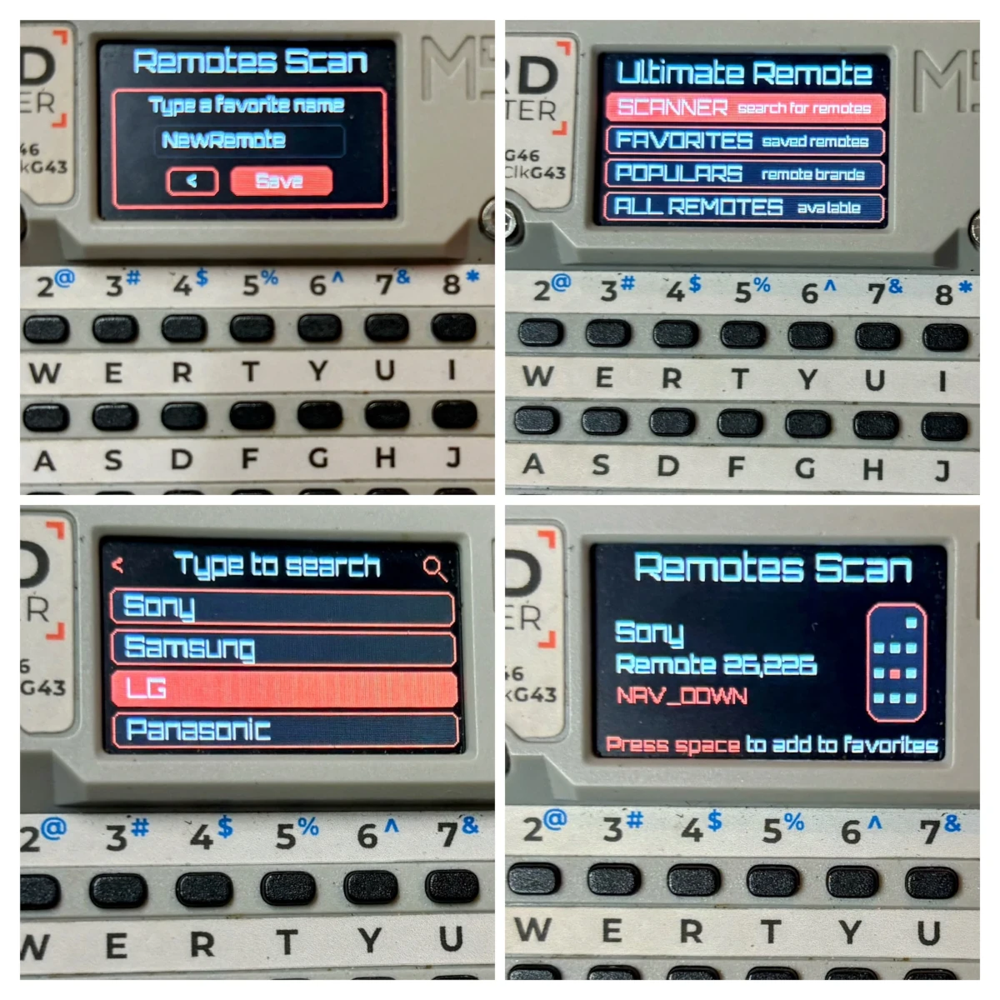

# Ultimate Remote for M5Cardputer

A powerful universal remote control for the M5Cardputer, <b>supporting 3488 remote profiles from 634 different manufacturers and containing around 30,000 commands.</b> It allows you to easily find a suitable remote for you device thanks to a automatic remotes scan.

## Key Features

- <b>Extensive Database:</b> Contains 3488 remote profiles from 634 different manufacturers.
- <b>Protocol Support:</b> Works with more than 60 infrared protocols.
- <b>Massive Command Set:</b> Supports more than 30,000 commands.
- <b>Scan and Find: </b>Allows you to scan for and find the correct remote from a particular manufacturer.
- <b>Favorites:</b> Easily add remotes to your favorites for quick access.
- <b>Navigation:</b> Navigate through different manufacturer folders to view all available remotes and save them.

## Installation

- <b>M5Burner</b> : Search into M5CARDPUTER section and simply burn it
- <b>Old school</b> : Build or take the firmware.bin from the [github release](https://github.com/geo-tp/Ultimate-Remote/releases/tag/v1.0) and flash it

## Usage

### Scanning for Remotes
Use the scan mode to automatically find the correct remote control profile for your device and save it to your favorites. It will scan all the avalaible remotes for a manufacturer to find the one that fits for your device.

1. Select Scanner
2. Choose a manufacturer
3. Wait until your device reacts to a remote
4. Press SPACE to add it to your favorites.

### Adding to Favorites
Once you find the correct remote, you can add it to your favorites for easy access later. You can pres SPACE during the scanning process to interrupt it and be able to save the remote. Your favorites are stored in the NVS partition so you don't need an SD card.

1. Press SPACE on any remotes commands list or during the scanning process to add the remote into your FAVORITES.
2. Press SPACE on any remotes in the FAVORITES section to delete it from FAVORITES.

(Up to 40 saved remotes + the 40 default favorites)

### Browse Remotes
You can explore the manufacturers by either scrolling through the list or typing the name of the brand you're looking for.

1. Navigate through the folders to explore all available remote profiles classed by manufacturer. 
2. Search manufacturer by typing names
3. Select a remote

### Use a Remote
Once you selected a remote, you can send IR commands with defined shortcuts or by clicking 'OK' button on the selected command.

1. Select a command and press 'OK' to send it
2. Use shortcuts to send the desired command.
3. Press SPACE to add the remote to your FAVORITES

## Keybinds

Remote's shortcuts are automatically assigned, however, keys like POWER will always have the shortcut 'P', CHANNEL_UP and CHANNEL_DOWN will always be '[' and ']', and VOL_UP and VOL_DOWN will always be '-+', the same goes for KEY_0 to KEY_9 and some others frequently used commands.

## Resources

[IRDB](https://github.com/probonopd/irdb) : This project utilizes the extensive irdb database for remote profiles.

[MakeHex](https://github.com/probonopd/MakeHex) : IR signals are generated using an adapted version of MakeHex.
